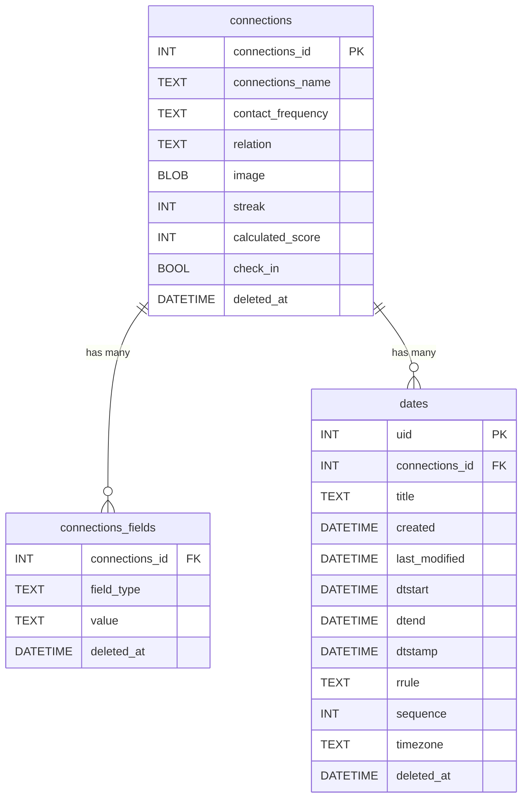

# 💞 Propinquity

**Propinquity** is a Flutter application that helps you stay meaningfully connected with the people who matter most.  
Whether it’s friends, family, or professional contacts, Propinquity gently reminds you to reach out, track relationship strength, and celebrate milestones.

---

## 🚀 Getting Started

### Prerequisites

- Flutter 3.22+ (uses GoRouter + Riverpod)
- Dart 3+
- Drift (Local SQL persistence)
- `flutter pub get`

### Project Structure

```
lib/
├── main.dart                     # App entry point
│
├── core/                         # Shared logic/utilities
│   ├── error/                    # Exceptions and failures
│   └── utils/                    # Constants, date helpers, etc.
│
├── domain/                       # Clean architecture domain layer
│   ├── entities/                 # Core types: Contact, Score, etc.
│   ├── repositories/             # Abstract contracts
│   └── usecases/                 # Business logic operations
│
├── data/                         # Data sources and persistence
│   ├── datasources/              # Local DB, notifications, storage
│   ├── models/                   # DTOs and conversions
│   └── repositories_impl/        # Concrete implementations
│
├── application/                  # App logic (Riverpod)
│   ├── providers/                # Riverpod Providers
│   └── state/                    # Controllers, StateNotifiers
│
├── presentation/                 # UI Layer
│   ├── pages/                    # Screens (Home, Settings, etc.)
│   ├── widgets/                  # Custom reusable components
│   └── routes/                   # GoRouter setup
│
└── l10n/, assets/, etc.          # Localization, icons, images
```

---

## 👤 User Stories by Feature

### 🔁 1. Contact Frequency Reminders
- “Remind me to reach out to Alice every 2 weeks.”
- Automated nudges when it’s been a while.

### ❤️ 2. Relationship Health Score
- Visual score reflects how “active” a connection is.
- Color-coded for at-a-glance insights.

### ⏱ 3. Dynamic Reminders
- Adjusts based on real interaction patterns.
- Smarter reminders over time.

### 🏷 4. Classify Relationships
- Tag contacts as friends, work, or family.
- Filter based on group types.

### 📝 5. Record Information
- Add personal notes about people.
- Track birthdays and anniversaries.

### ℹ️ 6. About the App
- Onboarding for new users.
- Transparent data and privacy handling.

### 🔥 7. Relationship Streaks
- Track how long you’ve been consistent.
- Gamify communication through visual streaks.

---

## 🧠 Data Model (ERD)



---

## 🛠 Built With

- 🐦 **Flutter** – cross-platform UI toolkit
- 🧪 **Riverpod** – state management
- 🧭 **GoRouter** – declarative navigation
- 💾 **Drift** – local SQLite persistence with reactive queries
- 🖼 **Custom Widgets** – handmade bottom nav bar, streak indicators, animations

---

## 🔐 Authentication (Coming Soon)

- Planned integration with supabase or custom login.
- Routes protected with GoRouter redirection logic.

---

## 🤝 Contributing

Coming soon. In the meantime, feel free to fork, explore, and reach out!

---

## 📄 License

MIT – [Feel free to use and adapt.](LICENSE)
