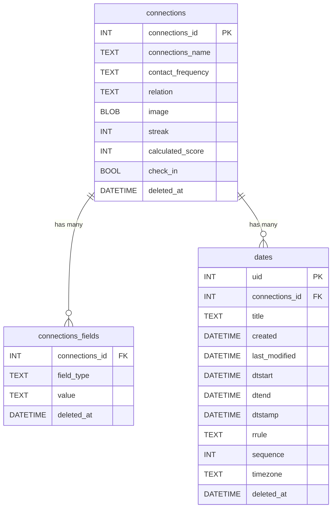

# Propinquity

An application to help you and your friends stay close.

## Getting Started
```
lib/
├── main.dart                     # App entry point, providers initialization
│
├── core/                         # Shared logic
│   ├── error/                    # Custom exceptions, failure classes
│   └── utils/                    # Utilities, date helpers, constants
│
├── domain/                       # Business logic layer (Pure Dart)
│   ├── entities/                 # Contact, Reminder, Score, etc.
│   ├── repositories/             # Abstract classes
│   └── usecases/                 # One file per use case (e.g. GetReminders)
│
├── data/                         # Data handling (models, sources, repos)
│   ├── datasources/              # Local DB, SharedPrefs, notification logic
│   ├── models/                   # DTOs for DB/storage
│   └── repositories_impl/        # Concrete repository implementations
│
├── application/                  # Providers and Riverpod logic
│   ├── providers/                # Feature-specific providers
│   └── state/                    # AsyncNotifiers, StateNotifiers, etc.
│
├── presentation/                 # UI Layer (Widgets, Pages)
│   ├── widgets/                  # Reusable UI components
│   ├── pages/                    # Screens (Home, ContactDetail, etc.)
│   └── routes/                   # GoRouter or Navigator setup
│
└── l10n/, assets/, etc.          # Optional: localization, images, etc.
```

## User Stories by Feature
### 1 - Contact Frequency Reminders

- As a user, I want to set how often I want to contact someone, so I can maintain my relationships without forgetting.

- As a user, I want to receive reminders when I’m due to contact someone, so I stay consistent.

### 2 - Relationship Health Score

- As a user, I want to see how “healthy” my connection is with someone, so I can identify who I’ve been neglecting.

- As a user, I want a simple color-coded score that updates based on my activity, so I can get a quick overview.

### 3 - Dynamic Reminders
- As a user, I want the app to learn from my behavior and adjust reminders, so they stay relevant and non-intrusive.

- As a user, I want to see when the next reminder is expected, even if it shifts.

### 4 - Classify Relationships

- As a user, I want to label people as friends, professional contacts, or others, so the app can give me appropriate suggestions.

- As a user, I want to filter my contacts by type, so I can focus on specific groups.

### 5 - Record Information
- As a user, I want to save notes about past conversations, so I can reference them later.

- As a user, I want to record birthdays and other important dates, so I can reach out meaningfully.

- As a user, I want to get notified before these important dates.

### 6 - About the App

- As a new user, I want to understand what the app does and how it benefits me, so I can decide to commit to using it.

- As a user, I want transparency about how the app handles my data and decisions.

### 7 - Relationship Streaks

- As a user, I want to track how long I’ve kept in touch with someone consistently, so I feel motivated to keep it going.

- As a user, I want a visual representation of my streaks to feel a sense of achievement.

